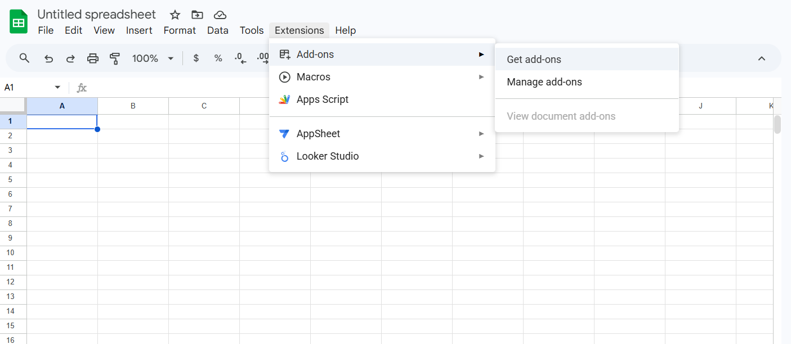
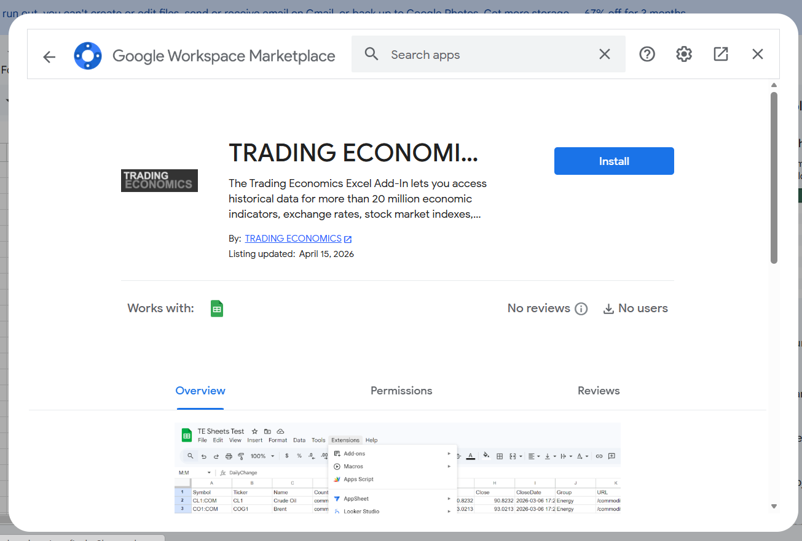
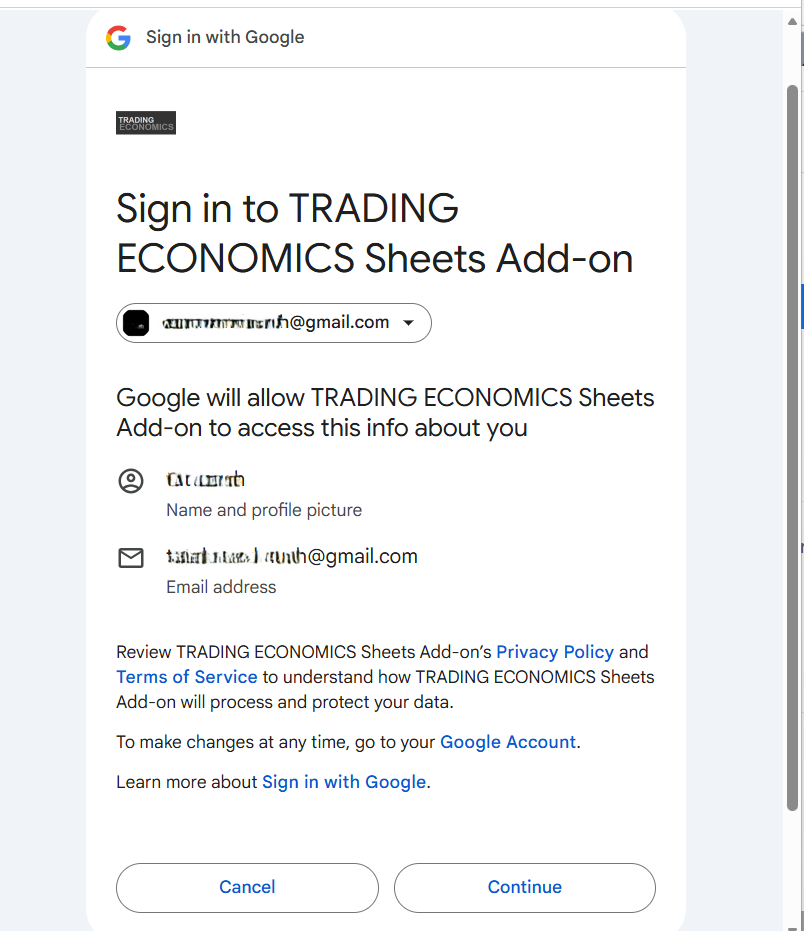
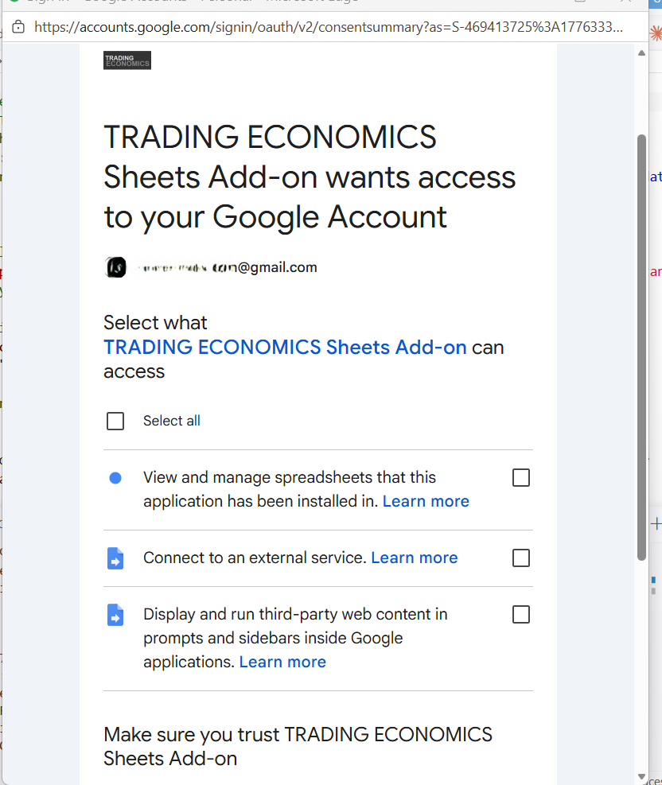
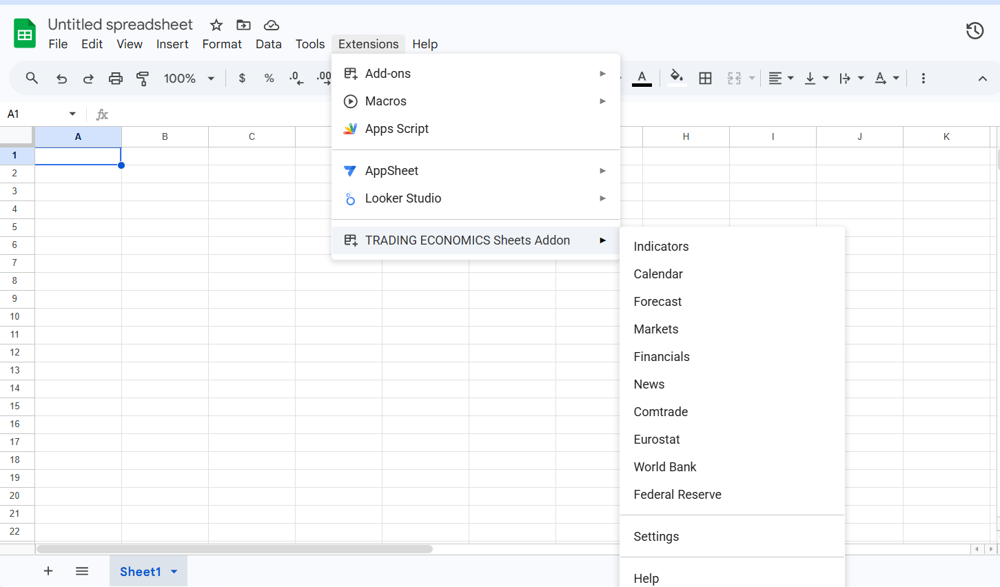

# Trading Economics Sheets Add-On — Setup Guide

This add-on connects Google Sheets to the [Trading Economics API](https://tradingeconomics.com/analytics/api.aspx), letting you pull live economic indicators, calendar events, forecasts, market data, and more directly into your spreadsheet.


<br>

## Requirements

- A Google account with access to [Google Sheets](https://sheets.google.com)
- A [Trading Economics API key](https://developer.tradingeconomics.com/Home/Keys)

<br>

## Installation

### Method 1 — Install from Google Workspace Marketplace

Use this method to install the add-on directly from Google Sheets in a few clicks.

#### Step 1 — Open the Add-ons Marketplace

1. Open a Google Sheets spreadsheet.
2. Go to **Extensions → Add-ons → Get add-ons**.



3. In the Google Workspace Marketplace, search for **Trading Economics**.
4. Click **Install** on **TRADING ECONOMICS Sheets Add-on**.



#### Step 2 — Sign In Popup

A Google popup will appear asking you to sign in to the **TRADING ECONOMICS Sheets Add-on**.

1. Click **Continue**.



#### Step 3 — Grant Permissions

In the next Google popup, grant the required access permissions.

1. Click **Select all**.
2. Click **Continue**.



#### Step 4 — Open the Add-On

After the permissions are accepted:

1. Go to **Extensions**.
2. Click **TRADING ECONOMICS Sheets Addon** to access indicators, calendar, markets, and settings.



3. Click **Settings** and enter your [Trading Economics API key](https://tradingeconomics.com/api/pricing.aspx?source=google-sheets) to start fetching data.

<br>

### Method 2 — Manual Installation via Apps Script

Use this method if you prefer to set up the add-on manually using the Apps Script editor.

#### Step 1 — Open the Apps Script Editor

1. Open your Google Sheets spreadsheet.
2. In the menu bar, go to **Extensions → Apps Script**.

> The Apps Script editor will open in a new browser tab.


<br>

#### Step 2 — Add the Script Code

1. In the Apps Script editor, click on the default **`Code.gs`** file in the left panel.
2. Delete all existing content in the editor.
3. Copy the full contents of **[`Code.gs`](Code.gs)** from this repository and paste it into the editor.
4. Press **Ctrl + S** (or **Cmd + S** on Mac) to save.
5. Click the **"+"** icon next to **"Files"**, select **"Script"**, and name it **`data`**.
6. Copy the full contents of **[`data.gs`](data.gs)** from this repository and paste it in.
7. Press **Ctrl + S** to save.


<br>

#### Step 3 — Configure the Manifest (appsscript.json)

The `appsscript.json` manifest declares the OAuth permissions the add-on needs to communicate with Google Sheets and the Trading Economics API.

1. In the Apps Script editor, click **Project Settings** (the gear icon ⚙️ in the left panel).
2. Check the box labelled **"Show 'appsscript.json' manifest file in editor"**.
3. Go back to the **Editor** view (the `<>` icon) — `appsscript.json` will now appear in the file list.
4. Click on **`appsscript.json`**, delete all existing content, and paste in the contents of **[`appsscript.json`](appsscript.json)** from this repository:

```json
{
  "timeZone": "Etc/UTC",
  "dependencies": {},
  "exceptionLogging": "STACKDRIVER",
  "runtimeVersion": "V8",
  "oauthScopes": [
    "https://www.googleapis.com/auth/script.storage",
    "https://www.googleapis.com/auth/spreadsheets",
    "https://www.googleapis.com/auth/script.container.ui",
    "https://www.googleapis.com/auth/script.external_request"
  ]
}
```

5. Press **Ctrl + S** (or **Cmd + S** on Mac) to save.

> The four OAuth scopes grant access to: store user properties, read/write the spreadsheet, display the sidebar UI, and make external HTTP requests to the Trading Economics API.

<br>

#### Step 4 — Add the Sidebar HTML File

1. In the Apps Script editor, click the **"+"** icon next to **"Files"** in the left panel.
2. Select **"HTML"** from the dropdown.
3. Name the new file exactly **`Sidebar`** (the editor will append `.html` automatically).
4. Delete all existing content in the new file.
5. Copy the full contents of **[`Sidebar.html`](Sidebar.html)** from this repository and paste it into the editor.
6. Press **Ctrl + S** (or **Cmd + S** on Mac) to save.

> **Important:** The file must be named `Sidebar` exactly — any other name will cause the add-on to fail.


<br>

#### Step 5 — Activate the Add-On

1. Go back to your Google Sheets spreadsheet and **refresh the page**.
2. After a few seconds, a new **"TE"** menu will appear in the menu bar between **"Help"** and the right edge.
3. Click **"TE"** to access the addin.

4. Start by clicking **"TE" → "Settings"** to enter your [Trading Economics API key](https://developer.tradingeconomics.com/Home/Keys).

<br>

## Notes

**Security warning on first use:**  
The first time you run the add-on, Google will display a warning: *"This app isn't verified."*


- Click **"Advanced"**
- Click **"Go to (project name) (unsafe)"** to proceed

This warning appears because the script runs under your own Google account. The code is fully open source and visible in this repository.

**Ensure your spreadsheet has enough rows:**  
Some data requests return large result sets. Make sure your spreadsheet has at least **10,000 rows** before fetching data. To add more rows, scroll to the bottom of the sheet and click **"Add [N] more rows"**.


<br>

## Documentation

Full API reference and usage guides: **[docs.tradingeconomics.com](https://docs.tradingeconomics.com)**

<br>

## API Access

Learn about plans and get your API key: **[tradingeconomics.com/api/pricing.aspx](https://tradingeconomics.com/api/pricing.aspx?source=google-sheets)**
